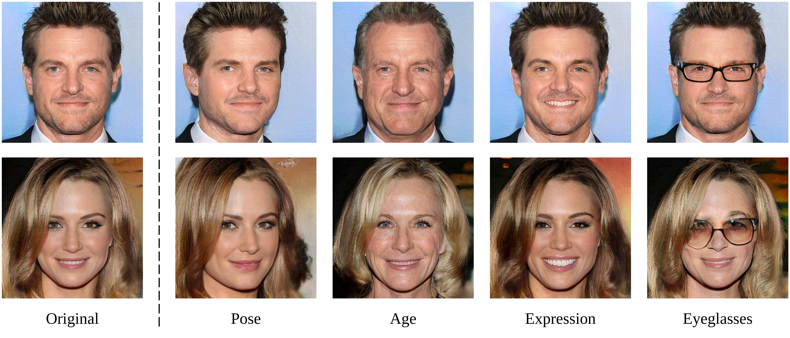

# Interpreting multiple latent features simulaneously

Refer to the Demo video for knowing how to use 

# InterFaceGAN - Interpreting the Latent Space of GANs for Semantic Face Editing

**Figure:** *High-quality facial attributes editing results with InterFaceGAN.*

In this repository, we propose an approach, termed as InterFaceGAN, for semantic face editing. Specifically, InterFaceGAN is capable of turning an unconditionally trained face synthesis model to controllable GAN by interpreting the very first latent space and finding the hidden semantic subspaces.

[[Colab](https://colab.research.google.com/github/genforce/interfacegan/blob/master/docs/InterFaceGAN.ipynb)]

## How to Use

Pick up a model, pick up a boundary, pick up a latent code, and then EDIT!

```bash
# Before running the following code, please first download
# the pre-trained ProgressiveGAN model on CelebA-HQ dataset,
# and then place it under the folder ".models/pretrain/".
LATENT_CODE_NUM=10
python edit.py \
    -m pggan_celebahq \
    -b boundaries/pggan_celebahq_smile_boundary.npy \
    -n "$LATENT_CODE_NUM" \
    -o results/pggan_celebahq_smile_editing
```

## GAN Models Used (Prior Work)

Before going into details, we would like to first introduce the two state-of-the-art GAN models used in this work, which are ProgressiveGAN (Karras *el al.*, ICLR 2018) and StyleGAN (Karras *et al.*, CVPR 2019). These two models achieve high-quality face synthesis by learning unconditional GANs. For more details about these two models, please refer to the original papers, as well as the official implementations.


## Code Instruction

  - Before used, new model should be first registered in `MODEL_POOL` in file `models/model_settings.py`.

### Utility Functions

We provide following utility functions in `utils/manipulator.py` to make InterFaceGAN much easier to use.

- `train_boundary()`: This function can be used for boundary searching. It takes pre-prepared latent codes and the corresponding attributes scores as inputs, and then outputs the normal direction of the separation boundary. Basically, this goal is achieved by training a linear SVM. The returned vector can be further used for semantic face editing.
- `project_boundary()`: This function can be used for conditional manipulation. It takes a primal direction and other conditional directions as inputs, and then outputs a new normalized direction. Moving latent code along this new direction will manipulate the primal attribute yet barely affect the conditioned attributes. NOTE: For now, at most two conditions are supported.
- `linear_interpolate()`: This function can be used for semantic face editing. It takes a latent code and the normal direction of a particular semantic boundary as inputs, and then outputs a collection of manipulated latent codes with linear interpolation. These interpolation can be used to see how the synthesis will vary if moving the latent code along the given direction.

### Tools

- `generate_data.py`: This script can be used for data preparation. It will generate a collection of syntheses (images are saved for further attribute prediction) as well as save the input latent codes.

- `train_boundary.py`: This script can be used for boundary searching.

- `edit.py`: This script can be usd for semantic face editing.

## Usage

We take ProgressiveGAN model trained on CelebA-HQ dataset as an instance.

### Prepare data

```bash
NUM=10000
python generate_data.py -m pggan_celebahq -o data/pggan_celebahq -n "$NUM"
```

### Predict Attribute Score

Get your own predictor for attribute `$ATTRIBUTE_NAME`, evaluate on all generated images, and save the inference results as `data/pggan_celebahq/"$ATTRIBUTE_NAME"_scores.npy`. NOTE: The save results should be with shape `($NUM, 1)`.

### Search Semantic Boundary

```bash
python train_boundary.py \
    -o boundaries/pggan_celebahq_"$ATTRIBUTE_NAME" \
    -c data/pggan_celebahq/z.npy \
    -s data/pggan_celebahq/"$ATTRIBUTE_NAME"_scores.npy
```

### Compute Conditional Boundary (Optional)

This step is optional. It depends on whether conditional manipulation is needed. Users can use function `project_boundary()` in file `utils/manipulator.py` to compute the projected direction.

## Boundaries Description

We provided following boundaries in folder `boundaries/`. The boundaries can be more accurate if stronger attribute predictor is used.

- ProgressiveGAN model trained on CelebA-HQ dataset:
  - Single boundary:
    - `pggan_celebahq_pose_boundary.npy`: Pose.
    - `pggan_celebahq_smile_boundary.npy`: Smile (expression).
    - `pggan_celebahq_age_boundary.npy`: Age.
    - `pggan_celebahq_gender_boundary.npy`: Gender.
    - `pggan_celebahq_eyeglasses_boundary.npy`: Eyeglasses.
    - `pggan_celebahq_quality_boundary.npy`: Image quality.
  - Conditional boundary:
    - `pggan_celebahq_age_c_gender_boundary.npy`: Age (conditioned on gender).
    - `pggan_celebahq_age_c_eyeglasses_boundary.npy`: Age (conditioned on eyeglasses).
    - `pggan_celebahq_gender_c_age_boundary.npy`: Gender (conditioned on age).
    - `pggan_celebahq_gender_c_eyeglasses_boundary.npy`: Gender (conditioned on eyeglasses).
    - `pggan_celebahq_eyeglasses_c_age_boundary.npy`: Eyeglasses (conditioned on age).
    - `pggan_celebahq_eyeglasses_c_gender_boundary.npy`: Eyeglasses (conditioned on gender).
- StyleGAN model trained on CelebA-HQ dataset:
  - Single boundary in $\mathcal{Z}$ space:
    - `stylegan_celebahq_pose_boundary.npy`: Pose.
    - `stylegan_celebahq_smile_boundary.npy`: Smile (expression).
    - `stylegan_celebahq_age_boundary.npy`: Age.
    - `stylegan_celebahq_gender_boundary.npy`: Gender.
    - `stylegan_celebahq_eyeglasses_boundary.npy`: Eyeglasses.
  - Single boundary in $\mathcal{W}$ space:
    - `stylegan_celebahq_pose_w_boundary.npy`: Pose.
    - `stylegan_celebahq_smile_w_boundary.npy`: Smile (expression).
    - `stylegan_celebahq_age_w_boundary.npy`: Age.
    - `stylegan_celebahq_gender_w_boundary.npy`: Gender.
    - `stylegan_celebahq_eyeglasses_w_boundary.npy`: Eyeglasses.

- StyleGAN model trained on FF-HQ dataset:
  - Single boundary in $\mathcal{Z}$ space:
    - `stylegan_ffhq_pose_boundary.npy`: Pose.
    - `stylegan_ffhq_smile_boundary.npy`: Smile (expression).
    - `stylegan_ffhq_age_boundary.npy`: Age.
    - `stylegan_ffhq_gender_boundary.npy`: Gender.
    - `stylegan_ffhq_eyeglasses_boundary.npy`: Eyeglasses.
  - Conditional boundary in $\mathcal{Z}$ space:
    - `stylegan_ffhq_age_c_gender_boundary.npy`: Age (conditioned on gender).
    - `stylegan_ffhq_age_c_eyeglasses_boundary.npy`: Age (conditioned on eyeglasses).
    - `stylegan_ffhq_eyeglasses_c_age_boundary.npy`: Eyeglasses (conditioned on age).
    - `stylegan_ffhq_eyeglasses_c_gender_boundary.npy`: Eyeglasses (conditioned on gender).
  - Single boundary in $\mathcal{W}$ space:
    - `stylegan_ffhq_pose_w_boundary.npy`: Pose.
    - `stylegan_ffhq_smile_w_boundary.npy`: Smile (expression).
    - `stylegan_ffhq_age_w_boundary.npy`: Age.
    - `stylegan_ffhq_gender_w_boundary.npy`: Gender.
    - `stylegan_ffhq_eyeglasses_w_boundary.npy`: Eyeglasses.


